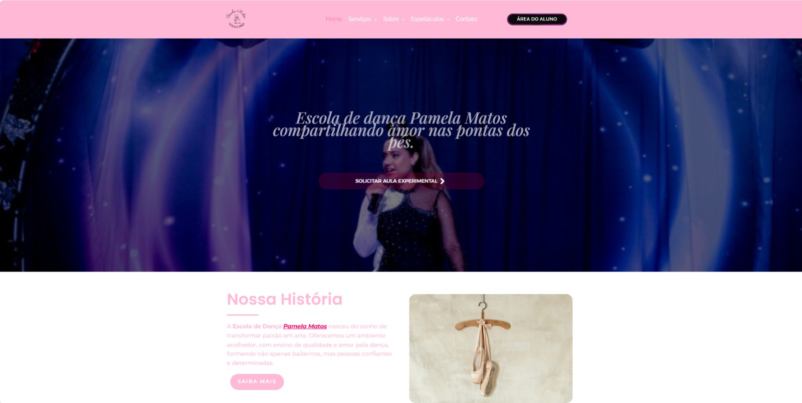
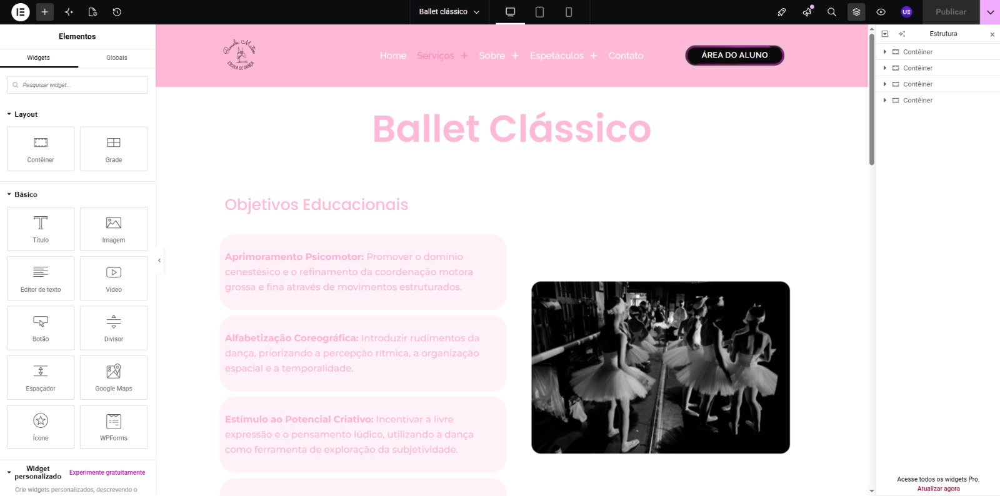
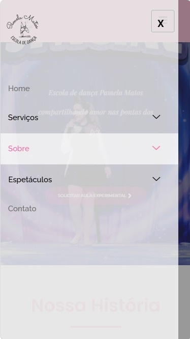

# 🌐 Site desenvolvido com WordPress e Elementor

## 📌 Sobre o projeto

Projeto de desenvolvimento de um site utilizando **WordPress e Elementor**, envolvendo criação e organização de páginas, estruturação do conteúdo, personalização visual e ajustes de responsividade.

---

## 🛠️ Tecnologias e ferramentas

* WordPress
* Elementor
* HTML
* CSS

---

## 👨‍💻 Atividades realizadas

Durante o desenvolvimento foram realizadas atividades como:

* Criação e organização das páginas;
* Desenvolvimento do layout;
* Personalização dos elementos;
* Organização de textos e imagens;
* Criação e organização de seções;
* Configuração de menus;
* Ajustes de espaçamento e alinhamento;
* Adaptação para diferentes tamanhos de tela;
* Testes de visualização e funcionamento.

---

## 🧩 Estrutura

O site foi organizado utilizando diferentes elementos disponíveis no Elementor, incluindo:

* Cabeçalho;
* Menu de navegação;
* Seções;
* Colunas;
* Textos;
* Imagens;
* Botões;
* Rodapé.

[Ver documentação da estrutura →](documentacao/estrutura.md)

---

## 📱 Responsividade

Foram realizados ajustes para adaptar a apresentação do site a diferentes tamanhos de tela.

Foram considerados aspectos como:

* Tamanho dos textos;
* Espaçamento;
* Imagens;
* Botões;
* Organização das seções;
* Navegação em dispositivos móveis.

[Ver documentação de responsividade →](documentacao/responsividade.md)

---

## 🖼️ Demonstração

### Página inicial

### Editor Elementor

### Visualização em dispositivo móvel

---

## 🔗 Site

**Acesse o projeto:**
[escoladedancapamelamatos.com.br](https://escoladedancapamelamatos.com.br/)

---

## 🧠 Competências demonstradas

* WordPress
* Elementor
* Criação de páginas
* Estruturação de conteúdo
* Personalização visual
* HTML/CSS
* Responsividade
* Organização de interfaces

---

## 📚 Documentação

| Documento                                          | Descrição                       |
| -------------------------------------------------- | ------------------------------- |
| [Desenvolvimento](documentacao/desenvolvimento.md) | Processo de desenvolvimento     |
| [Estrutura](documentacao/estrutura.md)             | Organização das páginas         |
| [Responsividade](documentacao/responsividade.md)   | Adaptação para diferentes telas |

---

## 🎯 Objetivo

Demonstrar conhecimentos práticos no desenvolvimento e organização de sites utilizando WordPress e Elementor.
