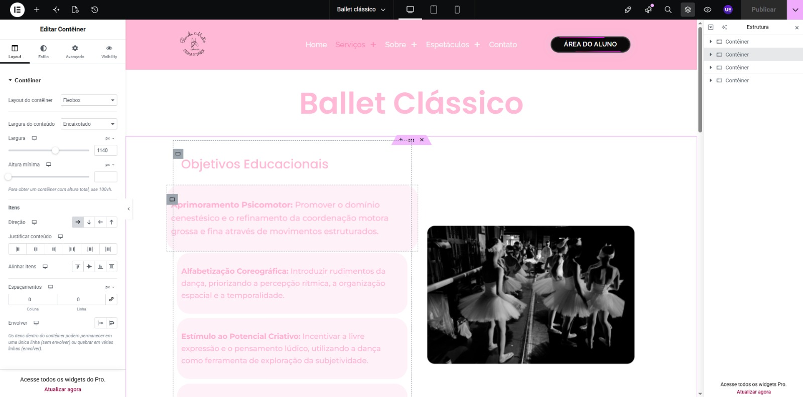
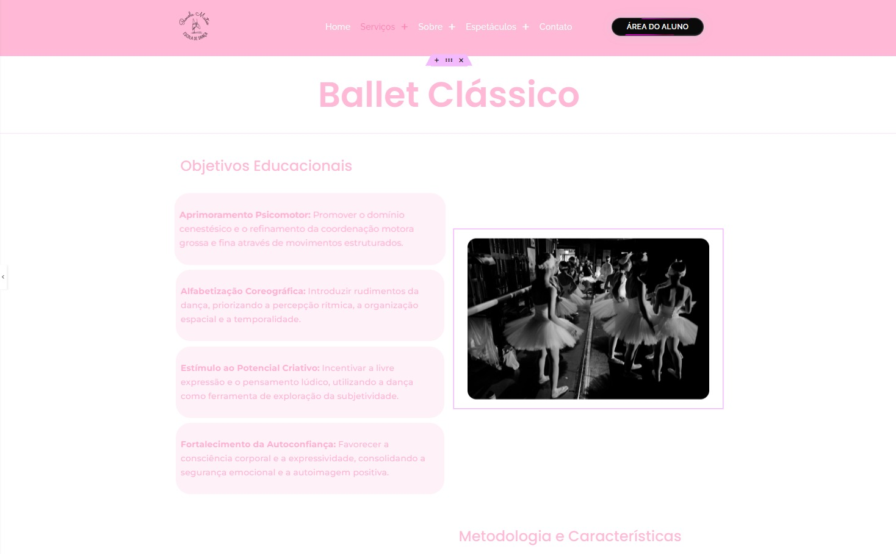
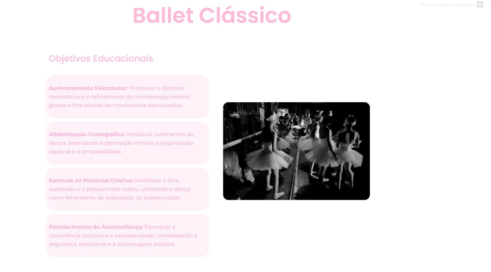
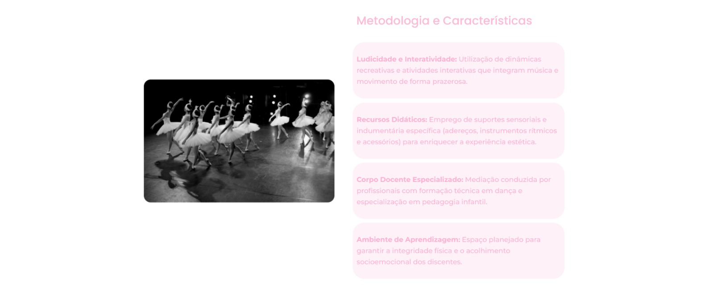
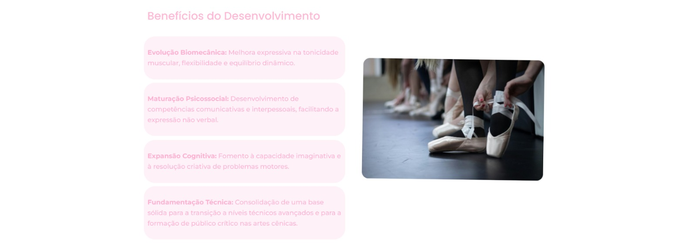

# 🛠️ Desenvolvimento do Site

## 📌 Objetivo

Documentar o processo de desenvolvimento do site utilizando WordPress e Elementor.

## 1. Estrutura inicial

O projeto foi desenvolvido utilizando o WordPress como plataforma de gerenciamento de conteúdo e o Elementor como ferramenta de criação e edição das páginas.

### 🖼️ Demonstração

## 2. Criação das páginas

As páginas foram criadas e organizadas de acordo com a estrutura definida para o site.

Foram realizados ajustes de:

* Seções;
* Colunas;
* Textos;
* Imagens;
* Botões;
* Menus;
* Espaçamentos.

### 🖼️ Demonstração

## 3. Personalização visual

Foram realizados ajustes nos elementos visuais para manter uma apresentação organizada e consistente.

### 🖼️ Demonstração

## 4. Resultado final

Após a criação e personalização das páginas, foram realizados testes para verificar a apresentação e o funcionamento do site.

### 🖼️ Demonstração

## ✅ Resultado

Site desenvolvido e estruturado de acordo com os objetivos definidos para o projeto.

