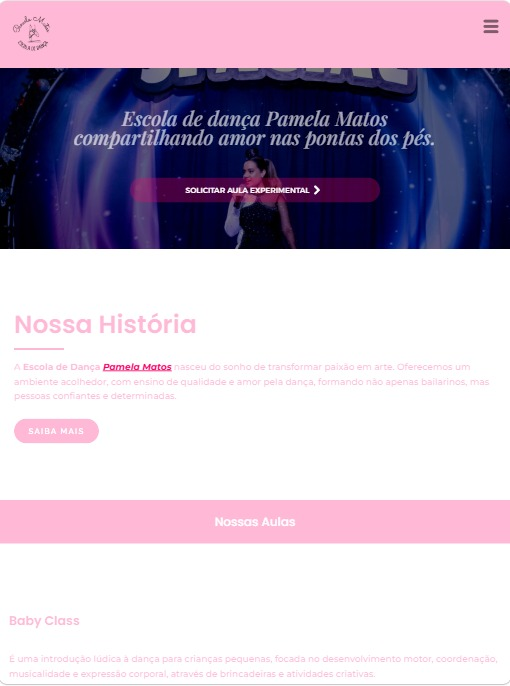

# 📱 Responsividade

## 📌 Objetivo

Verificar e adaptar a apresentação do site para diferentes tamanhos de tela.

## 💻 Computador

Foram realizados testes para verificar o alinhamento, espaçamento e organização dos elementos na visualização em desktop.

### 🖼️ Demonstração

## 📱 Dispositivos móveis

Também foram realizados ajustes para melhorar a visualização das páginas em telas menores.

Foram verificados:

* Tamanho dos textos;
* Espaçamento;
* Imagens;
* Botões;
* Organização das seções;
* Navegação.

### 🖼️ Demonstração

Responsivo Celular

Responsivo Tablet

## ✅ Resultado

Ajustes realizados para proporcionar uma experiência de navegação adequada em diferentes tamanhos de tela.

